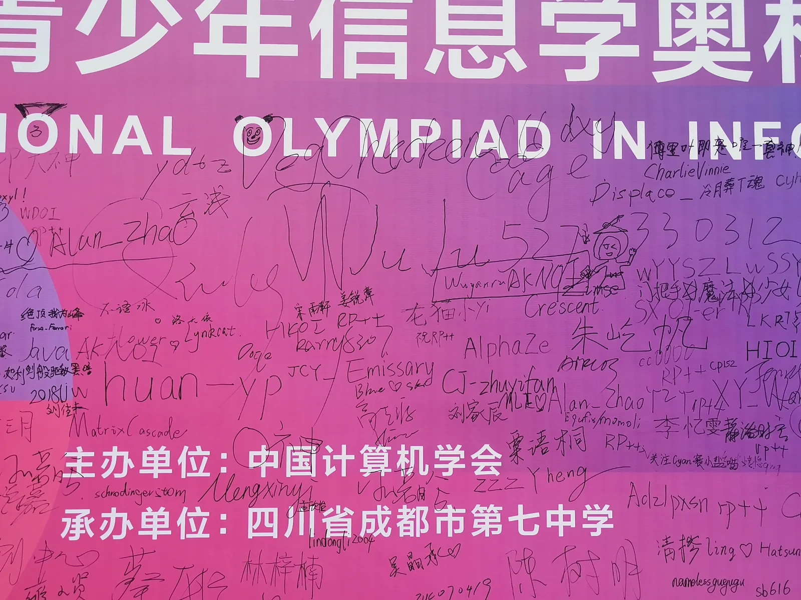
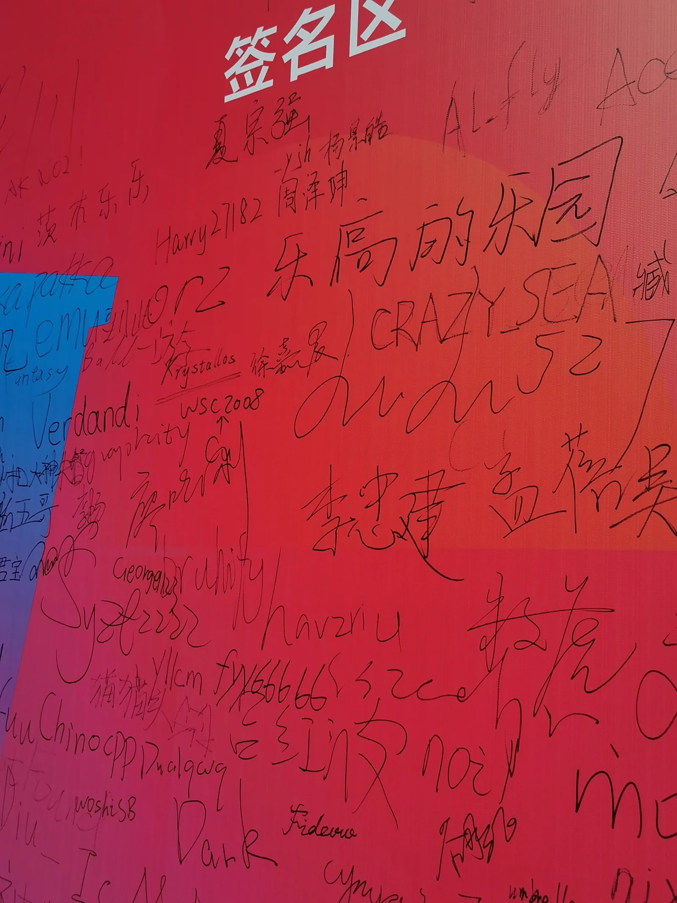
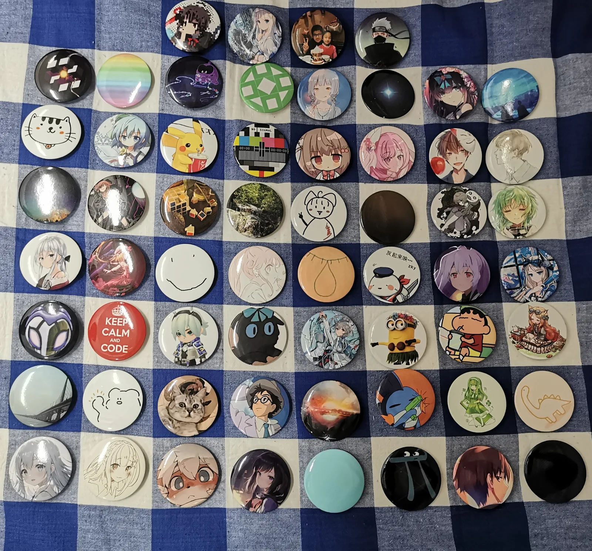

> 一百年后 没有你 也没有我。
>——《百年孤寂》

当博主决定开始写这篇博客，心情很复杂。写完那么多游记了，轮到最后一次 NOI 了吗。

想说的话很多，但一些观点可能更多应该出现在回忆录里，而并非本篇游记。博主写游记的目的是希望能记住这段青葱岁月，好好享受这场 NOI 吧！

### 7.22 前
博主接下了 NOI 徽章交换活动 HN 代表的任务，收集好了 HN 参赛选手的徽章头像和数目。有趣的是全省徽章数量前 4 被 YL 高二信息组包揽，什么摆怪组。

7.8 号坐飞机从南京出发到了成都，竟然和佳老师在没有提前交流的情况下买到了同一趟航班且前后排的座位，非常神奇！

7.9 号晚上是 NOI 前最后一把 ARC，因为 CF IGM 梦 4 了，其实还是有 ATC 上橙梦的，自我感觉完全有那个水平了！但是这一把 ARC 手感一般，前面的题做的不快，被 C 卡了好一会，冲 E 的时候因为对题意产生了一点理解的偏差导致赛后一些时间才过，perf 不好看。
说到 ARC 顺便提一嘴 hav 在 NOI 前绝杀完成了 ATC 5 Dan，非常恐怖，狂暴膜拜！

7.10 号开始在成七联考，排名大致是：20，10+?，15，22，5。中间打了两把 unr，感觉不好评价。

zyf 16 号和两个 YL 新高二 D 类以及两个新高一同学一起到了，摇奖和 hav 18 号到了。

发现 lk 此时也在成都，泰裤辣。19 号我组和 lk 约饭，吃了一餐石头火锅，味道不错，就是中途由于坐在室外，火动不动被凤吹灭了，很恼火，大部分时间在等锅开/tx。
晚上陪恺皇视察成都七中高新校区，发现 NOI 的标识已经贴满校园了，恺皇发表小升初回忆重要讲话，但是博主是很多选手的 OI 回忆录忠实读者，对于恺皇提到的事情了解的大差不差了，很趣味。

19 号，cxy 也来成都了！和 cxy 聊了一些话题，窥见准大学生生活的一角。

了解到宿舍有独立卫生间，但是公共澡堂？真神秘，不知道进了宿舍我能不能接受。

20 号在体育馆内考试！感觉比较热，键盘还行，不会有大的 debuff。

晚上和川子准备节目，川子好有技术力。

21 号在酒店待了一天！

### 7.22

早上 YL 高二 4 人最早进入学校，体验不错，不需要排队！
在签名墙上签下了大大的 juju527。

午餐好评！
中午 HN 省队到得差不多，组了几局谁是卧底和两把 12 人狼人杀，因为不是很会玩，选择当法官。
第一局第一晚节目效果爆炸，守卫守皇子，狼人刀皇子，皇子女巫自信不自救，反手毒死了一匹狼 qiuly，预言家查验皇子。这一轮民赢的很稳。
第二局我发牌平衡了一下游戏体验，把上一把当民的全给了身份，结果是狼赢了。

然后跟不少人换了徽章，本来以为自己订了 60 个应该很够了，很可能剩一些，但是晚上竟然 60 个换完了，痛苦，可能还想换一点，但是徽章不够了/dx。
> 数量不是很好排，第一行是我组，其它以随机顺序排列。

晚餐好评！

澡堂感觉还行啊，有帘子，去洗的时候也没啥人。

晚上 HN 省队齐聚一堂交流中学文言文课文，背了背一些会的人多一点的《岳阳楼记》，《梦游天姥吟留别》，很趣味。

晚上 10:30 睡觉了！但是走廊里的灯好像关得比较晚。

### 7.23
早上 7 点起床！早餐好评！

上午开幕式音响声音恐怖。川剧变脸看了很多次还是毫无头绪，确实是水平很高啊！中间有幸成为幸运观众近距离观察，表演者握住我的手，另一手上拿一个扇子，直接就变脸了。

无人机表演感觉无人机数量可能不够，去年摆了个 NOI，今年从无人机表演开始就在等无人机摆字，但是等到最后也没有/tx。

中午睡了会儿午觉，跑去打笔试了！笔试认真慢慢做了两遍，AK 了。场馆里还是比较热的，空调系统仍然是若干台立式空调放前面一排后面一排，感觉不太牛。
意识到这个时候去拍签名墙肯定没人，拍下了签名墙的照片素材。

晚上和 zyf 隔着学校门去见被 cxy 带过来的 gzr，聊了蛮久的。
然后去操场看川子和 wls 跑步，很有水平！花花本来说不跑来着，结果也跑了 3 圈，太卷了！！！1
和川子合练了一下节目。

今天洗澡很神秘啊，感觉人不少，选择的时间不太行，好多人洗的水很热，整个浴室里非常热，比较痛苦。

明天 Day1！！！

### 7.24
Day1

【数据删除】

$100+25+52=177$

下午新入坑了 ori，打了一会儿。

晚上 HN 省队 狼人杀。

### 7.25
早上 8 点多一点才起床，睡得挺好的，就是没啥早饭吃了。

去看了看嘉年华，发现好多人排队，润回宿舍了。
上午 ori，打了 4.5h，非常摆。
中午睡了个午觉，起床后 B 站。
和皇子快乐 mayhem，感觉还是能赢皇子的。

### 7.26
Day2

【数据删除】

$100+40+30=170$

发现没啥翻盘 Au 可能，快乐打摆！！！1
确实是技不如人，甘拜下风。

安利《雾山五行》。胡彦斌的动漫主题曲真的很不错啊，无论是《月光》还是新出的《天道》。

OI 生涯结束了，多少有点不真实感。
真心为 Au 的同学感到高兴，摇奖，ya 老师，希望高三这一年不要虚度啊！！
大头老师有点可惜，但是高一，未来可期！！！
qiuly 就没啥好说的，嘎嘎乱杀就是了。

留一段给比较新一点的朋友们。祝贺川子，花花，dyq，ylx，崔老师，佳老师进队！wzj，lcj 感觉都是 D1 太离谱了，很可惜，比我这种混子选手有水平多了。Michael 发挥差了点，很可惜；Linshey 怎么这么寄！！默哀。

YL 今年感觉打得不太行，竟然高二组 3 个 Ag，太抽象，希望一年后能一起在 T 相见。

博主可能不算一个特别自律的人，真的 Au 了可能真能摆一整年，感觉不一定是一个阳光健康的过程。
作为一个迷茫的少年，接下来一年有一个明确的目标（高考）可能对博主是个好事，什么时候才能更有内驱力呢！
对于博主来说，Au 确实是很好的结果，但 Ag 也不差。

OI 回忆录看看有没有想看的人咯，说不定学学语文试图好好写写，也是对中学生涯的一个告别了。

NOI 只是开始，我们正年轻，我们都有光明的前途。
