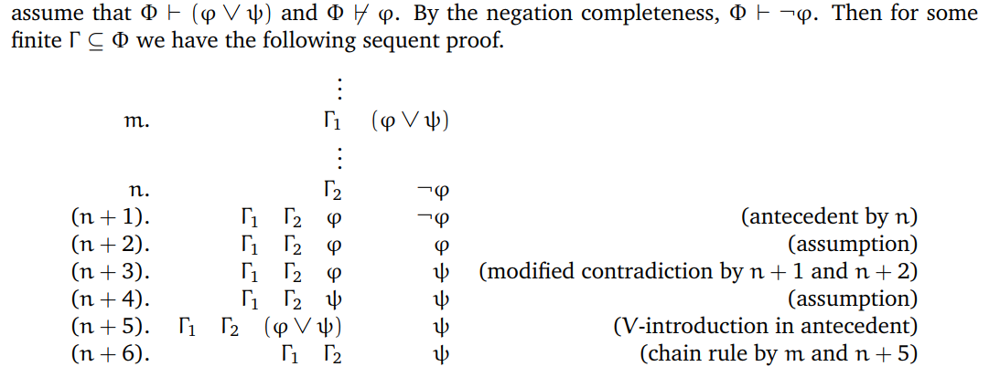

### 引言

我们希望讨论清楚 4 个问题：

1. 什么是数学证明？

   证明以一阶逻辑（first-order logic）为基础。

2. 什么决定了证明的正确性？

   存在形式证明系统：所有真数学命题均可证，所有可证命题均为真。

   这是哥德尔完备性定理（ Gödel Completeness Theorem）。

3. 可证性是否有边界？

   对于任何合理（reasonable）的证明系统，存在关于自然数 $\N$ 的真命题在该系统中不可证。

   这是哥德尔第一不完备性定理（Gödel’s First Incompleteness Theorem）。

4. 计算机能否寻找证明？

   不存在计算机程序能判定任意输入的数学命题是否可证。

   这就是图灵停机问题不可判定性（Turing’s undecidability of the halting problem）。

### 一阶逻辑的语法（The Syntax of First-order Logic）

这个部分讨论 Q1。

> 群论（Group theory）：满足结合律、单位元、逆元。
>
> 等价关系（Equivalence Relations）：满足自反性、对称性、传递性。

#### 字母表（Alphabets）

字母表（Alphabet）：一个**非空**的符号集合 $\mathbb A$。

词（word）：$\mathbb A$ 中符号的**有限**长度序列。

$\mathbb A^*=\cup_{n\in\N}\mathbb A^n$，$\mathbb A$ 上所有词的集合。

#### 可数集（Countable sets）

复习一下数分学过的内容。

Lemma：若 $\mathbb A$ 至多可数（at most countable），则 $\mathbb A^*$ 可数（countable）。

> 证明考虑 $\mathbb A\to \N$ 的单射 $g$，通过质因数分解实现 $w=a_1a_2\cdots a_n$ 到 $p_1^{g(a_1)}p_2^{g(a_2)}\cdots p_n^{g(a_n)}$ 的映射。

#### 一阶语言的字母表（The alphabet of a first-order language）

包括以下几种：

1. 变元（variables）：$v_0,v_1,v_2,\cdots$
2. 连接词：$\neg$（negation），$\land$（conjunction），$\lor$（disjunction），$\to$（implication），$\leftrightarrow$（if and only if）
3. 量词（quantifiers）：$\exist,\forall$
4. 等词（equality）：$\equiv$
5. 括号（parentheses）：$($,$)$
6. n 元关系符号（n-ary relation symbols）
7. n 元函数符号（n-ary function symbols）
8. 常元符号（constants）

$\mathbb A$ 是前 5 种符号的集合，后面 3 种放在 $S$ 集合中，注意 $S$ 可以为空。

$\mathbb A_S=\mathbb A\cup S$，$S$ 称为这个一阶语言的符号集（symbol set）。

#### 项与公式（Terms and formulas）

固定符号集 $S$。

递归定义项（term），$T^S$ 是项集合。

递归定义公式（formula），$L^S$ 是公式集合。

原子公式（atomic formulas）：$t_1\equiv t_2$，或者 $Rt_1t_2\cdots t_n$（$R$ 是一个 n 元关系）。

Lemma：$S$ 至多可数，则 $T^S,L^S$ 均可数。

$t$ 是一个 S-term，定义 $\text{var}(t)$ 作为 $t$ 中变元集合。

$\varphi$ 是一个 S-formula，定义 $\text{free}(t)$ 作为 $t$ 中自由元集合。

对于 S-formula $\varphi$，若 $\text{free}(\varphi)=\empty$，则称其为一个语句（S-sentence）。

定义 $L_n^S=\{\varphi|\varphi\text{ is an S-formula with free}(\varphi)\subset\{v_0,v_1,\cdots,v_{n-1}\}\}$。

特别的 $L_0^S$ 是 S-sentence 集合。

### 一阶逻辑的语义（The Semantics of First-order Logic  ）

这个部分讨论 Q1。

#### 结构与解释（Structures and interpretations）

一个 S-structure 是一个 $\mathfrak A=(A,\alpha)$ 对，满足：

1. $A\ne \empty$ 是 $\mathfrak A$ 的论域（universe）。
2. $\alpha$ 是定义在 $S$ 上的映射：
   - $R$ 是一个 n 元关系，$\alpha(R)\subset A^n$。
   - $f$ 是一个 n 元函数，$\alpha(f):A^n\to A$。
   - $c$ 是一个常数，$\alpha(c)\in A$。

我们用 $R^{\mathfrak A},f^{\mathfrak A},c^{\mathfrak A}$，甚至 $R^A,f^A,c^A$ 代表 $\alpha(R),\alpha(f),\alpha(c)$。

一个赋值（assignment）在 S-structure $\mathfrak A$ 中是一个映射 $\beta:\{v_i|i\in\N\}\to A$。

一个解释（interpretation） $\mathcal I$ 是一个 $(\mathfrak A,\beta)$ 对，指定了结构和赋值。

定义 $\beta\frac{a}{x}$，将 $x$ 的赋值改为 $a$。

#### 满足关系 $\mathcal I\models\varphi$（The satisfaction relation）

fix 一个 S-interpretation $\mathcal I=(\mathfrak A,\beta)$。

对于 S-term $t$，我们从 $\beta(x)$ 出发递归定义它的解释 $\mathcal I(t)$。

对于 S-formula $\varphi$，我们递归定义 $\mathcal I\models\varphi$；若 $\mathcal I\models\varphi$，则 $\mathcal I$ 是 $\varphi$ 的一个模型（model），或者说 $\mathcal I$ 满足（satisfies） $\varphi$。

$\Phi$ 是一个 S-formulas 集合，若 $\forall \varphi\in \Phi:\mathcal I\models \varphi$，则称 $\mathcal I\models \Phi$。

对于 S-formulas 集合 $\Phi$ 和 S-formula $\varphi$，若 $\forall \mathcal I:\mathcal I\models \Phi\to\mathcal I\models \varphi$，则称 $\varphi$ 是 $\Phi$ 的后承（consequence），写作 $\Phi\models\varphi$。

特别的，单个 S-formula 构成的集合，有时简写不带集合符号：$\psi\models\varphi$，即 $\{\psi\}\models\varphi$。

> 注意，$\models$ 代表的可能是 satisfies 也可能是 consequence，而且之后的讨论里可能 consequence 的频率很高，不要想成了 satisfies。

对于一个 S-formula $\varphi$，如果 $\empty\models\varphi$，即 $\forall \mathcal I:\mathcal I\models\varphi$，则称 $\varphi$ 有效（valid），记作 $\models\varphi$。

对于一个 S-formula $\varphi$，如果 $\exists \mathcal I:\mathcal I\models\varphi$，则称 $\varphi$ 可满足的（satisfiable）。

对于一个 S-formulas 集合 $\Phi$，如果 $\exists \mathcal I\forall \varphi\in \Phi:\mathcal I\models \varphi$，则称 $\Phi$ 可满足的。

Lemma：$\Phi\models\varphi$ 等价于 $\Phi\cup\{\neg\varphi\}$ 不可满足。

称两 S-formula $\varphi,\psi$ 逻辑等价（logic equivalent），即 $\varphi\models\psi,\psi\models\varphi$ 均成立。

我们可以只考虑 $\neg,\lor,\exist$，简化后续的讨论。

#### 同构（Isomorphism）

Lemma：重合引理（The Coincidence Lemma）

对于符号集 $S_1,S_2$，有 $S_1$-interpretation $\mathcal I_1$ 和 $S_2$-interpretation $\mathcal I_2$，满足 $A_1=A_2$。

$S=S_1\cap S_2$ 中符号的解释在 $\mathfrak A_1,\mathfrak A_2$ 中一致。

1. $t$ 是一个 S-term，如果 $\forall x\in \text{var}(t):\beta_1(x)=\beta_2(x)$，那么 $\mathcal I_1(t)=\mathcal I_2(t)$。
2. $\varphi$ 是一个 S-formula，且 $\forall x\in \text{free}(\varphi):\beta_1(x)=\beta_2(x)$，那么 $\mathcal I_1\models \varphi\iff\mathcal I_2\models\varphi$。

> 证明：根据项/公式的定义进行归纳即可。

> Rmk：根据重合引理，对于一个 $\varphi\in L_n^S$，
>
> 任何一个解释只有结构和前 $n$ 个变元的赋值重要。
>
> 对于 $\mathcal I\models \varphi$，我们也可以记为 $\mathfrak A\models \varphi[a_0,a_1,\cdots,a_{n-1}]$。
>
> 特别的，对于一个 S-sentence，我们记成 $\mathfrak A\models \varphi$ 也是无歧义的。
>
> 相似的对于项的解释 $\mathcal I(t)$ 和 $t^{\mathfrak A}[a_0,a_1,\cdots,a_{n-1}]$ 等价。

> 这里又引入了 $\models$ 的一个新的用法，$\mathfrak A\models \varphi$，注意理解其含义，本质还是 satisfies，只是 $\varphi$ 作为 sentence 跟 assignment 没关系了，只留下了 structure。

对于两个 S-structures $\mathfrak A,\mathfrak B$：

1. 如果下面几个条件满足，一个映射 $\pi:A\to B$ 被称为从 $\mathfrak A$ 到 $\mathfrak B$ 的同构映射（isomorphism）
   - $\pi$ 是一个双射（bijection）。
   - 保关系：对于 n 元关系 $R\in S$，$(a_0,a_1,\cdots,a_{n-1})\in R^A\iff(\pi(a_0),\pi(a_1),\cdots,\pi(a_{n-1}))\in R^B$。
   - 保运算：对于 n 元函数 $f\in S$，$\pi(f^A(a_0,a_1,\cdots,a_{n-1}))=f^B(\pi(a_0),\pi(a_1),\cdots,\pi(a_{n-1}))$。
   - 保常元：对于常元 $c\in S$，$\pi(c^A)=c^B$。
2. 若有一个同构映射 $\pi:A\to B$，则称 $\mathfrak A,\mathfrak B$ 同构，写作 $\mathfrak A\cong \mathfrak B$。

> 虽然上面的定义并不对称，但我们可以轻松的证明 $\cong$ 是一个等价关系。

Lemma：同构引理（The Isomorphism Lemma）

对于两同构 S-structure $\mathfrak A,\mathfrak B$：$\forall \varphi\in L_0^S:\mathfrak A\models\varphi\iff \mathfrak B\models \varphi$。

> 证明仍是对于 $L_0^S$ 做结构归纳，利用同构映射证明等价性。

同构引理与重合引理的直接推论：$\forall \varphi\in L_n^S,a_0,a_1,\cdots,a_{n-1}\in A:\mathfrak A\models\varphi[a_0,a_1,\cdots,a_{n-1}]\iff\mathfrak B\models\varphi[\pi(a_0),\pi(a_1),\cdots,\pi(a_{n-1})]$

#### 替换（Substitution）

$t$ 是一个 S-term，$x_0,\cdots,x_r$ 是变元，$t_0,\cdots,t_r$ 是 S-term，可以归纳定义替换后 S-term $t\frac{t_0,\cdots,t_r}{x_0,\cdots,x_r}$ 的定义。

同理我们试图归纳定义进行替换操作后的 S-formula $\varphi\frac{t_0,\cdots,t_r}{x_0,\cdots,x_r}$，定义存在时会麻烦一点，可能要整一个编号最小的 fresh variable 使得替换操作定义唯一。

Lemma：替换引理（The Substitution Lemma）

1. $\forall t\in T^S:\mathcal I(t\frac{t_0,\cdots,t_r}{x_0,\cdots,x_r})=\mathcal I\frac{\mathcal I(t_0),\cdots,\mathcal I(t_r)}{x_0,\cdots,x_r}(t)$。
2. $\forall \varphi\in L^S:\mathcal I\models \varphi\frac{t_0,\cdots,t_r}{x_0,\cdots,x_r}\iff \mathcal I\frac{\mathcal I(t_0),\cdots,\mathcal I(t_r)}{x_0,\cdots,x_r}\models \varphi$。

> 证明细节挺多，大体思路仍然是结构归纳。
>
> 可以看到替换引理开始搭建语法与语义的关系。

### 矢列演算（Sequent Calculus）

给出证明的正式定义：我们将证明划分阶段，每个阶段我们断言在一些前件（antecedent）$\varphi_1,\varphi_2,\cdots,\varphi_n$ 成立的前提，后件（succedent）$\varphi$ 成立。

简记为一条矢列（sequent）：$\varphi_1\cdots\varphi_n\varphi$。

我们的目标是设计一套作用于矢列的演算 $\mathfrak S$，即矢列演算（Sequent Calculus），包含若干推理规则，允许我们从一些矢列推导出新的矢列。

我们 fix 一个符号集 $S$。

若演算 $\mathfrak S$ 中存在矢列 $\Gamma\varphi$ 的一个推导，记为 $\vdash \Gamma\varphi$，我们称 $\Gamma\varphi$ 是可推导的（derivable）。

公式 $\varphi$ 从公式集 $\Phi$ 形式可证/可推导（provable/derivable），若存在有限个公式 $\varphi_1,\varphi_2\cdots,\varphi_n\in \Phi$，使得 $\vdash\varphi_1\cdots\varphi_n\varphi$，记为 $\Phi\vdash \varphi$。

矢列 $\Gamma\varphi$ 是正确的（correct），若 $\{\psi|\psi\in \Gamma\}\models\varphi$，简单来说 $\Gamma\models\varphi$。

#### 基本规则（Basic Rules）

Antecedent, Assumption, Case Analysis, Contradiction, $\lor$-intro in antecedent, $\lor$-intro in succedent（两个），$\exists$-intro in succedent/antecedent（有一个额外条件）,Equality, Substitution

这个部分要放到 Cheating paper 里，不太能记住。

#### 导出规则（Derived Rules）

一些例子：

1. 排中律
2. 修改版矛盾律
3. 链式演绎

Lemma：$\Phi\vdash\varphi\iff$ 存在有限集合 $\Phi_0\subset\Phi$，满足 $\Phi_0\vdash\varphi$。

Thm：可靠性（Soundness）

若 $\Phi\vdash\varphi$，则有 $\Phi\models\varphi$。

> 注意这里的 $\models$ 是 consequence （后承）。

由矢列演算的正确性得到了可靠性定理。

### 一致性（Consistency）

如果不存在 $\varphi$ 使得 $\Phi\vdash\varphi,\Phi\vdash\neg\varphi$ 同时成立，我们称 $\Phi$ 是一致的，记作 $\text{cons}(\Phi)$。

Lemma：$\Phi$ 不一致，当且仅当 $\forall \varphi\in L^S:\Phi\vdash \varphi$。

> 证明考虑使用修改版矛盾律。

Corollary：$\Phi$ 一致，当且仅当 $\exists \varphi\in L^S:\Phi\not\vdash \varphi$。

Lemma：$\Phi$ 一致，当且仅当所有有限子集一致。

> 这是矢列演算的有限性决定的。

Lemma：任何可满足的 $\Phi$ 都是一致的。

> 反证，不可能有模型同时满足 $\varphi$ 与 $\neg\varphi$。

Lemma：

1. $\Phi\vdash \varphi\iff \text{incons}(\Phi\cup\{\neg\varphi\})$
2. $\Phi\vdash \neg\varphi\iff\text{incons}(\Phi\cup\{\varphi\})$
3. 若 $\text{cons}(\Phi)$，那么要么 $\text{cons}(\Phi\cup\{\varphi\})$ 要么 $\text{cons}(\Phi\cup\{\neg\varphi\})$。

### 完备性（Completeness）

这个部分的目标是证明完备性定理。

Thm(Completeness)：如果 $\Phi\models\varphi$，那么有 $\Phi\vdash \varphi$。

> 考虑逆否命题 $\Phi\not\vdash\varphi\to\Phi\not\models\varphi$
>
> 等价于 $\text{cons}(\Phi\cup\{\neg\varphi\})\to\Phi\cup\{\neg\varphi\} \text{ is satisfiable}$。
>
> 我们下面实际上证明的更一般的定理是：$\text{cons}(\Phi)\to \Phi\text{ is satisfiable}$。

#### 亨金定理（Henkin's Theorem）

固定一个 S-formulas 集合 $\Phi$。

目标是证明：$\text{cons}(\Phi)\to \Phi\text{ is satisfiable}$。

核心的想法是对于一个一致的 $\Phi$，构造一个模型说明满足 $\Phi$。

我们需要一些工具准备来证明这个定理。

定义一个等价关系 $\sim$：

对于 $t_1,t_2\in T^S$，若 $\Phi\vdash t_1\equiv t_2$，则称 $t_1\sim t_2$。

Lemma：$\sim$ 是一个同余关系（congruence relation）

具体的，$\sim$ 保关系，保运算。

> 证明考虑使用矢列演算中的 Equality 和 Substitution Rule。

我们定义 $t\in T^S$ 的等价类 $\bar t=\{t'\in T^S|t'\sim t\}$。

定义 $\Phi$ 的项结构（term structure），记作 $\mathfrak T^\Phi$，定义如下：

1. 论域 $T^\Phi=\{\bar t|t\in T^S\}$。所有项等价类。
2. 对于每个 $S$ 中的 n 元关系 $R$，若 $\Phi\vdash Rt_1t_2\cdots t_n$，则 $(\bar{t_1},\bar{t_2},\cdots,\bar{t_n})\in R^{\mathfrak T^\Phi}$。
3. 对于每个 $S$ 中的 n 元函数 $f$，$f^{\mathfrak T^\Phi}(\bar{t_1},\bar{t_2},\cdots,\bar{t_n})=\overline{ft_1t_2\cdots t_n}$。
4. 对于每个 $S$ 中的常元 $c$，$c^{\mathfrak T^\Phi}=\bar c$。

为了得到一个完整的项模型（term model），我们还需要给出赋值：

对于任意一个变元 $v$，定义 $\beta^\Phi(v)=\bar v$。

那么我们有项模型 $\mathfrak I^\Phi=(\mathfrak T^\Phi,\beta^\Phi)$。

Lemma：

1. $\forall t\in T^S$，$\mathfrak I^\Phi(t)=\bar t$。
2. 对于任意**原子公式** $\varphi$，有 $\mathfrak I\models \varphi\iff \Phi\vdash \varphi$。

> 1 的证明考虑归纳即可，较为简单。
>
> 2 的证明只有原子公式也是简单的。
>
> 这里没法一步到位证出所有公式，我们目标是对所有公式成立。

Lemma：

$\varphi$ 是一个 S-formula，$x_1,x_2,\cdots,x_n$ 是两两不同的 $n$ 个变元：

$\mathfrak I^\Phi\models\exists x_1\exists x_2\cdots\exists x_n\varphi$ 当且仅当存在 S-terms $t_1,t_2,\cdots,t_n$，满足 $\mathfrak I^\Phi\models\varphi\dfrac{t_1\cdots t_n}{x_1\cdots x_n}$。

> 证明用一下 The Substitution Lemma 即可。

对于一个 S-formulas 集合 $\Phi$：

1. 若 $\forall \varphi\in L^S:(\Phi\vdash \varphi)\lor(\Phi\vdash\neg \varphi)$，则称其否定完备（negation complete）。
2. 若 $\forall \varphi\in L^S,x\text{ is a variable }\exists t\in T^S:\Phi\vdash(\exists x\varphi\to \varphi\dfrac t x)$，则称其含见证元（contains witnesses）。

Lemma：对于一个 consistent, negation complete, and contains witnesses 的 S-formulas 集合 $\Phi$，对于任意两 S-formulas $\varphi,\psi$，有下面的性质成立：

1. $\Phi\vdash \varphi\iff \Phi\not\vdash\neg\varphi$。
2. $\Phi\vdash (\varphi\lor\psi)\iff \Phi\vdash \varphi\lor\Phi\vdash \psi$。
3. $\Phi\vdash\exists x\varphi\iff\exists t\in T^S:\Phi\vdash \varphi\dfrac t x$。

> 证明：
>
> 1. 由 consistent 可推左到右，由 negation complete 可推右到左。
>
> 2. 右到左是 $\lor$-intro in succedent 得证，左到右复杂一些：
>
>    
>
> 3. 利用 contain witnesses 和 Modus ponens（$\Phi\vdash \varphi,\Phi\vdash \varphi\to\psi$，得 $\Phi\vdash \psi$）可证。

Thm(Henkin's Theorem)：

对于任意一个 S-formula $\varphi$，有：
$$
\mathfrak I^\Phi\models \varphi\iff \Phi\vdash \varphi
$$

> 证明：
>
> 原子公式已经得证
>
> 由上述 3 个 Lemma 可以完成结构归纳。
>
> 我们将归纳顺序定义成逻辑连接词增序归纳。

Corollary：若 $\Phi\subset L^S$ 一致，否定完备且含见证元，则有 $\mathfrak I^\Phi\models\Phi$。

#### 可数情形（The countable case）

fix 一个至多可数的符号集合 $S$，$T^S,L^S$ 可数。

对于 $\Phi\subset L^S$，我们定义 $\text{free}(\Phi)=\cup_{\varphi\in \Phi}\text{free}(\varphi)$。

Lemma：

1. $\Phi\subset L^S$ 一致且有有限的 $\text{free}(\Phi)$，存在一个一致的 $\Psi$，满足 $\Phi\subset \Psi\subset L^S$，且 $\Psi$ 含见证元。
2. $\Psi\subset L^S$ 一致，存在一个一致的 $\Theta$ 满足，$\Psi\subset \Theta\subset L^S$，且 $\Theta$ 否定完备。

Corollary：

对于一个一致的且有**有限自由元**的 $\Phi\subset L^S$，存在一个 $\Theta$，满足 $\Phi\subset \Theta \subset L^S$，且 $\Theta$ 满足 consistent, negation complete, and contains witnesses。进一步的由上面的工作，我们知道 $\mathfrak I^\Theta\models \Theta$，知 $\Phi$ 可满足。

> 这里要记得我们的最终目标还是 $\text{cons}(\Phi)\to \Phi \text{ is satisfiable}$。

> 对于 Lemma 的证明：
>
> 1. $L^S$ 可数，我们枚举 $\varphi$，把 contains witnesses 的语句塞进 $\Psi$ 里。
>
>    有技巧的部分是要找一个 fresh variable 和证明赛完之后仍 consistent。
>
>    归纳，反证法，去用矢列演算推矛盾。
>
> 2. 仍然枚举 $\varphi$，如果加入 $\varphi_n$ 仍然一致，就加入，否则说明一定能推出 $\neg \varphi$。

至此，我们得到了有限自由元版本的命题，接下来试图去掉这个限制。

Corollary：

若 $S$ 可数，且 $\Phi\subset L^S$ 一致，那么有 $\Phi$ 可满足的。

> 证明：
>
> 构造 $S'=S\cup\{c_0,c_1,\cdots\}$。
>
> 对于 $\varphi\in L^S$，定义 $n(\varphi)=\min\{n|\varphi\in L_n^S\}$。
>
> 构造 $\varphi'=\varphi\dfrac{c_0\cdots,c_{n(\varphi)-1}}{v_0\cdots,v_{n(\varphi)-1}}$。
>
> 构造 $\Phi'=\{\varphi'|\varphi\in \Phi\}\subset L^{S'}$.
>
> 现在 $\text{free}(\Phi')=\empty$。
>
> 我们还要说明 $\Phi'$ 是一致的，利用上述有限自由元版本结论知存在 $\mathfrak I'\models\Phi'$，再通过 Substitution Lemma 证明 $\mathfrak I'\models \Phi$。

#### 一般情形（The general case）

Lemma：

1. $\Phi\subset L^S$ 一致，那么存在一个符号集合 $S\subset S'$，和一个一致的 $\Phi\subset \Psi\subset L^{S'}$，满足 $\Psi$ 含见证元。
2. $\Psi\subset L^S$ 一致，那么存在一个一致的 $\Theta$ 满足， $\Psi\subset \Theta\subset L^S$，满足 $\Theta$ 否定完备（这一条跟可数情形一样，但因 $L^S$ 不可数，原先的证明不适用了）。

Corollary：我们想要的一般结论： $\Phi\subset L^S$ 一致，则 $\Phi$ 可满足。

Lemma 1：

> 证明：
>
> 我们要给符号集合引入一些见证元 $c_{\exists x\varphi}$。
>
> 塞入 contains witnesses 语句时可数版本要求了一个 fresh variable，这里用见证元即可。
>
> 我们要证明塞入这些新语句之后仍一致，这个部分很 tricky。

证明 Lemma 2 前先给出

Lemma （佐恩引理，Zorn's Lemma）：

$\mathcal M$ 是一个集合，$\mathcal U\subset \text{powerset}(\mathcal M)$，说一个非空子集 $\mathcal C\subset \mathcal U$ 是一个 $\mathcal U$ 中的链（chain），如果 $\forall T_1,T_2\in \mathcal C:T_1\subset T_2\lor T_2\subset T_1$。

那么若对于任何一个 $\mathcal U$ 中的链 $\mathcal C$，有 $\cup C:=\{a|a\in T,\exists T\in C\}\in \mathcal U$，则 $\mathcal U$ 有极大元 $T$。

最终我们得到了 Completeness。

### 勒文海姆–斯科伦定理与紧致性定理（The Lowenheim-Skolem Theorem and the Compactness Theorem）

运用项解释，验证下列定理是简单的：

Thm（Lowenheim-Skolem）：

$\Phi\subset L^S$ 至多可数且可满足，那么存在一个 S-interpretation $\mathfrak I=(\mathfrak A,\beta)$ 满足：

1. 论域 $A$ 至多可数。
2. $\mathfrak I\models \Phi$。

定理有更一般的版本：

Thm（Downward Lowenheim-Skolem）：

$\Phi\subset L^S$ 可满足，那么存在一个 S-interpretation $\mathfrak I=(\mathfrak A,\beta)$ 满足：

1. $|A|\le |T^S|=|L^S|$。
2. $\mathfrak I\models \Phi$。

Cor：

$S=\{+,\times,\lt,0,1\}$，$\Phi_\R=\{\varphi\in L_0^S|(\R,+,\times,\lt,0,1)\models\varphi\}$。

由上述定理，存在一个可数 S-structure $\mathfrak A$ 满足 $\mathfrak A\models\Phi_\R$。

Thm（紧致性，Compactness）：

1. $\Phi\models \varphi\iff\exists\text{ finite }\Phi_0\subset \Phi:\Phi_0\models\varphi$。
2. $\Phi \text{ is satisfiable}\iff\forall \text{finite }\Phi_0\subset \Phi:\Phi_0\text{ is satisfiable}$。

这和拓扑学中的紧性概念很相似，很像有限开覆盖。

对于 $\varphi\in L^S$，我们定义 $\text{Mod}(\varphi):=\{\mathfrak I|\mathfrak I\models\varphi\}$，$\text{Mod}(\Phi)=\cap_{\varphi\in\Phi}\text{Mod}(\varphi)$。

Prop：

$\text{Mod}(\varphi)\subset\cup_{\psi\in\Phi}\text{Mod}(\psi)\iff\exists \text{ finite }\Phi_0\subset \Phi:\text{Mod}(\varphi)\subset\cup_{\psi\in\Phi_0}\text{Mod}(\psi)$。

> Compactness 与上述命题等价，证明略去。

Thm：

$\Phi\subset L^S$，$\forall n\in\N,\exists \mathfrak I_n=(\mathfrak A_n,\beta_n):|A_n|\ge n,\mathfrak I_n\models \Phi$，
那么存在一个 $\mathfrak I=(\mathfrak A,\beta)$，其中 $|A|$ 无限且 $\mathfrak I\models \Phi$。

> 证明：
>
> 构造 sentence $\varphi_{\ge n}$ 刻画论域元素至少有 $n$ 个。
>
> 考虑 $\Phi\cup\{\varphi_{\ge n}|n\ge 2\}$。
>
> 运用 compactness，由于每个有限子集都可满足，知本身可满足。

Thm（Upward Lowenheim-Skolem）：

$\Phi\subset L^S$，有一个 S-interpretation $\mathfrak I=(\mathfrak A,\beta)$，满足 $A$ 无限且 $\mathfrak I\models \Phi$。

那么对于任意 $B$，存在一个 S-interpretation $\mathfrak I'=(\mathfrak A',\beta')$ 满足 $|A'|\ge |B|,\mathfrak I'\models \Phi$。

> 证明：
>
> 考虑对于每个 $b\in B$，引入一个新常元 $c_b\in S$，且不同的 $b$ 对应常元的解释不能相同（论域中至少 $|B|$ 个元素 ）。
>
> 考虑 $\Psi=\Phi\cup\{\neg c_b\equiv c_{b'}|b,b'\in B\}$。
>
> 由于 $\Phi$ 有一个无限的解释，任何 $\Psi$ 的有限子集都可满足，则 $\Psi$ 可满足。

### 可判定性与可枚举性（Decidability and Enumerability）

这个部分回答 Q4。

#### 程序、可判定性、可枚举性、可计算函数

Def（程序，procedure/program）：

这里使用寄存器模型定义程序。

Register machines 有一个字母表 $\mathcal A$，有固定数量的寄存器（register），每一个寄存器存储了一个 $\mathcal A^*$ 中的单词。

程序包括五种指令：

1. 给 $R_i$ 词尾加某个字符。
2. 给 $R_i$ 词尾删某个字符。
3. 根据 $R_i$ 词尾状态跳转（空也要考虑）。
4. 打印 $R_0$ 中的词语。
5. 停机。

定义程序输入 $w$ 表示初始时 $R_0=w$，且其它寄存器为空（$\square$）。

如果 $\mathbb P$ 在 $w$ 输入下最终停机，写作：$\mathbb P:w\to \text{halt}$，否则 $\mathbb P:w\to\infty$。

更具体的，若停机，若恰好输出一个串 $w'$，记作 $\mathbb P:w\to w'$。

Def（可判定性，decidability）：

对于一个字符集 $\mathcal A$，和一个单词集合 $W\subset \mathcal A^*$，
称 $W$ 可判定（decidable）如果存在一个程序 $\mathbb P$ 满足：

对于任何输入 $w\in \mathcal A^*$，$\mathbb P$ 将会停机且输出一个 $w'$，满足 $w'=\square \iff w\in W$。

Def（可枚举性，enumerability）：

对于一个字符集 $\mathcal A$，和一个单词集合 $W\subset \mathcal A^*$，
称 $W$ 可枚举（enumerable）如果存在一个程序 $\mathbb P$ 满足：

无输入，输出 $W$ 的所有元素（以任何顺序，允许重复）。

**由于很多时候要判断的 $W$ 并不有限，这里不强调停机。** 

> Lemma 如果有一个 $W$ 的枚举程序，就存在一个不重复的 $W$ 枚举程序。

定义 $S_{\infty}=\{c_0,c_1,\cdots\}\cup\bigcup_{n\ge 1}\{R_0^n,R_1^n,\cdots\}\cup\bigcup_{n\ge 1}\{f_0^n,f_1^n,\cdots\}$。

Eg: $\{\varphi\in L_0^{S_{\infty}}|\models\varphi\}$ 可枚举。

> 证明：
>
> 由于 Completeness，上述集合与 $\{\varphi\in L_0^{S_\infty}|\vdash \varphi\}$ 等价。
>
> Sequent calculus 可以枚举，故该集合可枚举。

Thm：任何可判定的集合是可枚举的。

> 证明：
>
> 枚举单词，用判定程序 check 是否在集合中即可。

Thm：$W\subset \mathcal A^*$，$W$ 可判定当且仅当 $W,\mathcal A^*/ W$ 均可枚举。

> 证明：
>
> 左到右就是上一个定理。
>
> 右到左考虑同时做两个枚举程序，$\forall w$ 会在恰好一个程序的枚举过程中出现，此时即可判定。

可以看出来 decidable 比 enumerable 更强一些。

Def（可计算函数，computable functions）：

$\mathcal A,\mathcal B$ 是两个字母表，一个程序对于任何一个 $w\in \mathcal A^*$ 输出一个 $w'\in \mathcal B^*$，决定了一个函数 $f:\mathcal A^*\to \mathcal B^*$。

若有这样的程序，称 $f$ 可计算（computable）。

> 上述 decidable, enumerable, computable 一般都可以加 R- 前缀，表示在 register 模型上满足这样的性质。

#### 寄存器模型的停机问题

固定一个字母表 $\mathcal A=\{a_0,a_1,\cdots,a_r\}$。

我们首先给出程序的编码，用 $n$ 个 $a_0$ 字符表示字典序为 $n$ 的压缩串。

$\mathbb P\to w_\mathbb P$ 称作哥德尔编码（Gödel numbering）。

定义 $\Pi=\{w_\mathbb P |\mathbb P\text{ is a program}\}$。

> Lemma：$\Pi$ 可判定。

Thm：

1. $\Pi'_{halt}=\{w_\mathbb P| \mathbb P\text{ is a program}\land \mathbb P:w_\mathbb P\to \text{halt}\}$ 不 R-decidable。
2. $\Pi_{halt}=\{w_\mathbb P| \mathbb P\text{ is a program}\land \mathbb P:\square\to \text{halt}\}$ 不 R-decidable。

> 证明：
>
> 1. 我们使用对角线方法证明这个命题。
>
>    反证法，假设有一个 $\mathbb P_0$ 判定了 $\Pi'_{halt}$，那么对于任意一个程序 $\mathbb P$：
>
>    $\mathbb P_0:w_\mathbb P\to \square$，$\mathbb P$ 在 $w_\mathbb P$ 停机。
>
>    $\mathbb P_0:w_\mathbb P\to w\ne\square$，$\mathbb P$ 在 $w_\mathbb P$ 不停机。
>
>    我们在 $\mathbb P_0$ 的基础上构造 $\mathbb P_1$ 使得：
>
>    $\mathbb P_1:w_\mathbb P\to \infty$，$\mathbb P$ 在 $w_\mathbb P$ 停机。
>
>    $\mathbb P_1:w_\mathbb P\to \text{halt}$，$\mathbb P$ 在 $w_\mathbb P$ 不停机。
>
>    考察 $\mathbb P_1$ 在 $w_{\mathbb P_1}$ 的停机情况，无论是否停机均矛盾。
>
>    则得证，不存在这样的 $\mathbb P_0$。
>
> 2. 依旧反证，假设有一个 $\mathbb P_0$ 判定了 $\Pi_{halt}$，那么对于任意一个程序 $\mathbb P$：
>
>    $\mathbb P_0:w_\mathbb P\to \square$，$\mathbb P$ 在 $\square$ 停机。
>
>    $\mathbb P_0:w_\mathbb P\to w\ne\square$，$\mathbb P$ 在 $\square$ 不停机。
>
>    我们对于每一个 $\mathbb P$ **有效地**构造一个 $\mathbb P^+$ 满足：$\mathbb P^+:w_\mathbb P\to\text{halt}\iff\mathbb P:\square\to\text{halt}$。
>
>    有效地：在这里指存在一个程序 $\mathbb T$ 计算了映射 $w_{\mathbb P}\to w_{\mathbb P^+}$。
>
>    完成完这个构造我们就得到了 1 中的 $P_0$，推出了矛盾。
>
>    fix 一个 $\mathbb P$，我们只需在 $\mathbb P$ 运行开始前给 $R_0$ 加上 $|w_\mathbb P|$ 个 $a_0$ 就得到了 $\mathbb P^+$。

> 有趣的是上述两个停机问题都是可枚举的。

#### 一阶逻辑的不可判定性（The undecidability of first-order logic）

Def（规约，reduction）：

$W_a\subset A^*,W_b\subset B^*$，称 $W_a$ 可以多一规约（many-one reducible）到 $W_b$ 如果存在一个可计算的映射 $f:A^*\to B^*$，使得 $\forall w\in A^*:w\in W_a\iff f(w)\in W_b$。

记作 $W_a\le_m W_b$。

> 规约直观上描述了问题间的难易关系，下面两个 Lemma 反映了这一点。

Lemma：

若 $W_a\le_m W_b$

1. 如果 $W_a$ 不可判定，则 $W_b$ 也不可判定。
2. 如果 $W_a$ 不可枚举，则 $W_b$ 也不可枚举。

> 证明利用定义并不困难。

Thm：$\{\varphi\in L_0^{S_\infty}|\models \varphi\}$ 不可判定。

> 证明：
>
> 我们的整体目标是把问题归约到图灵停机问题证明一阶逻辑的不可判定性。
>
> 具体的，我们固定字母表是单字符 $\{|\}$，对于每个程序 $\mathbb P$，我们**有效地**构造一个 $\varphi_{\mathbb P}\in L_0^{S_\infty}$，满足 $\mathbb P:\square\to \text{halt}\iff \models \varphi_{\mathbb P}$。
>
> 同样，这里“有效地”意味着构造一个程序 $\mathbb P_1$ 计算了映射 $\mathbb P\to \varphi_{\mathbb P}$。

为了用 $\varphi_{\mathbb P}$ 刻画程序停机，我们引入格局（configuration）：

对于有 $n+1$ 个寄存器的程序，定义一个 $n+2$ 元组 $(L,m_0,\cdots,m_n)$ 作为程序运行状态的一个格局。

$L$ 表示执行到程序的第 $L$ 个指令，$m_i$ 表示下标为 $i$ 的寄存器里的字符数目。

初始状态 $(0,0,\cdots,0)$，对于 $\mathbb P$ 中的每一条指令写一个 sentence 可画格局的变化。

具体的，用一个 $n+2$ 元关系 $R$ 可画所有可达格局即可。

综上，我们证明了一阶逻辑的不可判定性。

#### 理论与可公理化性（Theories and Axiomatizability）

Def（理论）：

称一个 S-sentences 的集合 $T\subset L_0^S$ 是一个理论（theory），若：

1. $T$ 是可满足的。
2. $T$ 在后承关系下是闭的，即 $\forall \varphi\in L_0^S:T\models \varphi\to\varphi\in T$。

Eg：若 $\mathfrak A$ 是一个 S-structure，$\text{Th}(\mathfrak A)=\{\varphi\in L_0^S|\mathfrak A\models \varphi\}$ 是一个理论。

定义一个结构：$\mathfrak N:=(\N,+,\cdot,0,1)$，我们将 $\text{Th}(\mathfrak N)$ 称作初等算数（elementary arithmetic）。

定义 $T^{\models}=\{\varphi\in L_0^S|T\models \varphi\}$。

Lemma：

下列三个命题等价：

1. $T^\models$ 是一个理论。
2. $T$ 可满足。
3. $T^\models\ne L_0^S$。

Def（皮亚诺算数，Peano Arithmetic）：

$S_{ar}=\{+,\cdot,0,1\}$，定义 $\Phi_{PA}$ 包括下列 $S_{ar}$-sentences。
$$
\begin{align*}
& \forall x \neg x + 1 \equiv 0, \\
& \forall x\ x + 0 \equiv x, \\
& \forall x\ x \cdot 0 \equiv 0, \\
& \forall x \forall y (x + 1 \equiv y + 1 \to x \equiv y), \\
& \forall x \forall y\ x + (y + 1) \equiv (x + y) + 1, \\
& \forall x \forall y\ x \cdot (y + 1) \equiv x \cdot y + x,
\end{align*}
$$
对于所有 $n \in \mathbb{N}$, 所有变元 $x_1, \dots, x_n, y$, 和所有 $\varphi \in L^{\mathrm{S}_\mathrm{ar}}$ 满足 \[ \mathrm{free}(\varphi) \subseteq \{x_1, \dots, x_n, y\} \],下列句子 \[ \forall x_1 \cdots \forall x_n \left( \left( \varphi \frac{0}{y} \land \forall y \left( \varphi \rightarrow \varphi \frac{y+1}{y} \right) \right) \rightarrow \forall y \varphi \right) \]。（归纳法）

很容易看到 $\mathfrak N\models \Phi_{PA}$，也即 $\Phi_{PA}^\models\subset \text{Th}(\mathfrak N)$，我们将会展示 $\Phi_{PA}^\models\subsetneq \text{Th}(\mathfrak N)$。

Def（可公理化的，axiomatizable）：

若 $T\subset L_0^S$ 是一个理论。

1. $T$ 是可公理化的如果存在一个 R-decidable 的 $\Phi\subset L_0^S$ 满足 $T=\Phi^\models$。
2. $T$ 是有限可公理化的如果存在一个有限的 $\Phi\subset L_0^S$ 满足 $T=\Phi^\models$。

Thm：任何一个可公理化的理论都是可枚举的。

> 枚举证明，看初始条件是否来自 $\Phi$ 即可。

Rmk：存在一个可公理化的理论但不可判定，例子是 $S=S_\infty,\Phi=\empty$，得到的理论是所有 valid 的 sentence，由一阶逻辑的不可判定性知其不可判定。

Def（完备，complete）：

称一个理论 $T\in L_0^S$ 完备（complete），若对于任何一个 $\varphi\in L_0^S$，有 $\varphi\in T$ 或者 $\neg \varphi\in T$ 成立。

Thm：

1. 任何一个可公理化的完备的理论是可判定的。
2. 任何一个可枚举的完备的理论是可判定的。

#### 初等算数的不可判定性（The Undecidability of Elementary Arithmetic）

Thm：$\text{Th}(\mathfrak N)$ 不可判定。

再一次的，我们固定字母表 $\mathcal A=\{|\}$，试图把初等算数归约到图灵停机问题，那么我们的目标是：

对于一个程序 $\mathbb P$，构造一个 $S_{ar}$-sentence $\varphi_{\mathbb P}$ 满足 $\mathfrak N\models \varphi_{\mathbb P}\iff \mathbb P:\square\to \text{halt}$。

我们还是利用 configuration 的语言，但这次没法直接整一个关系可画能到达的格局。

我们试图构造这样的 $S_{ar}$-formula $\chi_{\mathbb P}(x_0,\cdots,x_n,z,y_0,\cdots,y_n)$，满足：

$\mathfrak N\models \chi_{\mathbb P}(x_0,\cdots,x_n,L,y_0,\cdots,y_n)\iff (0,x_0,\cdots,x_n)$ 经过有限步到达了 $(L,y_0,\cdots,y_n)$。 

从一个格局走到另一个格局我们可以用一个格局列描述 $C_0,C_1,\cdots,C_s$，相邻格局可以一步到达。

但由于步数没有界，我们没法写固定个数的量词来直接描述，我们引入哥德尔 $\beta$ 函数：

$\beta:\N^3\to \N$。 

1. $\forall r\in \N,(a_0,\cdots,a_r)\in \N,\exists t,p\in\N:\forall i\le r,\beta(t,p,i)=a_i$。
2. $\beta$ 在 $L^{S_{ar}}$ 中可定义，即存在一个 $S_{ar}$ 公式 $\varphi_{\beta}(x,y,z,w)$ 满足对于任意的 $t,q,i,a\in \N$：$\mathfrak N\models \varphi_{\beta}[t,q,i,a]\iff \beta(t,q,i)=a$。

有了这一工具我们可以刻画 $\chi_{\mathbb P}$ 了。

$\beta$ 的一种较为方便的刻画是利用 $p$ 进制表示，偶数项插靶子奇数项放信息。

### 哥德尔不完全性定理（Gödel's Incompleteness Theorems）

Thm：

1. $\mathscr R\subset \N^r$ 是一个可判定的关系，那么存在一个 $S_{ar}$-formula $\varphi(v_0,\cdots,v_{r-1})$ 满足对于所有 $l_0,\cdots,l_{r-1}\in \N$：$(l_0,\cdots,l_{r-1})\in\mathscr R\iff \mathfrak N\models \varphi(l_0,\cdots,l_{r-1})$。

2. $f:\N^r\to \N$ 是一个可计算的映射，那么存在一个 $S_{ar}$-formula $\varphi(v_0,\cdots,v_{r-1},v_r)$ 满足对于所有 $l_0,\cdots,l_{r-1},l_r\in \N$：$f(l_0,\cdots,l_{r-1})=l_r\iff\mathfrak N\models \varphi(l_0,\cdots,l_{r-1},l_r)$。

   **因此**，$\mathfrak N\models \exists^{=1}v_r\varphi(l_0,\cdots,l_{r-1},v_r)$。

> 运用上面构造的 $\chi_{\mathbb P}$ 可以容易地验证这个定理。

Def：

1. 称一个关系 $\mathscr R\subset \N^r$ 是在 $\Phi$ 中可表示的（representable）如果有一个 $S_{ar}$ 公式 $\varphi(v_0,\cdots,v_{r-1})$ 满足对于所有的 $n_0,\cdots,n_{r-1}\in \N$：
   $$
   \begin{align*}
   (n_0, \dots, n_{r-1}) \in \mathscr{R} &\implies \Phi \vdash \varphi(\bar{n}_0, \dots, \bar{n}_{r-1}), \\
   (n_0, \dots, n_{r-1}) \notin \mathscr{R} &\implies \Phi \vdash \neg\varphi(\bar{n}_0, \dots, \bar{n}_{r-1}).
   \end{align*}
   $$

2. 一个函数 $f:\N^r\to \N$ 是在 $\Phi$ 中可表示的，如果有一个 $S_{ar}$ 公式 $\varphi(v_0,\cdots,v_{r-1},v_r)$，满足对于所有的 $n_0,\cdots,n_{r-1},n_r\in\N$：
   $$
   \begin{align*}
   f(n_0, \dots, n_{r-1}) = n_r &\implies \Phi \vdash \varphi(\bar{n}_0, \dots, \bar{n}_{r-1}, \bar{n}_r), \\
   f(n_0, \dots, n_{r-1}) \neq n_r &\implies \Phi \vdash \neg\varphi(\bar{n}_0, \dots, \bar{n}_{r-1}, \bar{n}_r).
   \end{align*}
   $$
   **且**
   $$
   \Phi \vdash \exists^{=1} v_r \varphi(\bar{n}_0, \dots, \bar{n}_{r-1}, v_r).
   $$

Lemma：

1. 如果 $\Phi$ 是不一致的，所有的关系和函数在 $\Phi$ 中都是可表示的。
2. $\Phi\subset \Phi'\subset L_0^{S_{ar}}$，任意在 $\Phi$ 中可表示的关系/函数，在 $\Phi'$ 中仍然可表示。
3. $\Phi$ 是一致的，如果 $\Phi$ 是可判定的，则 $\Phi$ 中任意可表示的关系是可判定的，任意可表示的函数是可计算的。

> 3 依旧枚举证明，由于前件是否来自 $\Phi$ 可判定，知流程可行。

Def（允许表示，allows representations）：

称 $\Phi$ 允许表示如果 $\N$ 中所有的可判定的关系和所有可计算的函数在 $\Phi$ 中可表示。

Thm：$\text{Th}(\mathfrak N)$ 允许表示。

> 这个就是这一节写的第一个定理，容易验证 $\text{Th}(\mathfrak N)$ 表达能力足够强。

Thm：$\Phi_{PA}$ 允许表示。

之前对程序做了一个哥德尔编码，这里要对 $L^{S_{ar}}$ 做编码，编码出的第 $n$ 个公式 $[\varphi_n]:=n$。

编码与解码都是可计算的。

Thm（不动点定理，Fixed Point Theorem）：

$\Phi$ 允许表示，对于任意 $\psi\in L_1^{S_{ar}}$，存在一个 $S_{ar}$-sentence $\varphi$ 满足：$\Phi\vdash (\varphi\iff \psi(\overline{[\varphi]}))$。

Def：$\Phi^{\vdash}=\{\varphi\in L^{S_{ar}}|\Phi\vdash \varphi\}$。

Lemma：

$\Phi\subset L^{S_{ar}}$ 一致且允许表示，那么 $\Phi^{\vdash}$ 在 $\Phi$ 中不可表示。

> 证明：
>
> 反证，若 $\Phi^{\vdash}$ 在 $\Phi$ 中可表示，存在一个 $\chi(v_0)\in L_1^{S_{ar}}$，对于 $\varphi\in L_0^{S_{ar}}$：
>
> $\Phi\vdash \varphi\implies \Phi\vdash \chi(\overline{[\varphi]})$，$\Phi\not\vdash \varphi\implies \Phi\vdash \neg\chi(\overline{[\varphi]})$。
>
> 又因为 $\Phi$ 一致，有 $\Phi\not\vdash \varphi\iff \Phi\vdash \neg\chi(\overline{[\varphi]})$。
>
> 我们应用不动点定理，对于 $\neg \chi$，存在一个 sentence $\varphi$ 满足：
>
> $\Phi\vdash (\varphi\iff \neg \chi(\overline{[\varphi]}))$，推出 $\Phi\vdash \varphi\iff\Phi\vdash \neg \chi(\overline{[\varphi]})$，得到矛盾。

Thm（塔斯基算术真不可定义定理，Tarski’s Undefinability of the Arithmetic Truth ）：

1. $\Phi\subset L^{S_{ar}}$ 一致且允许表示，那么 $\Phi^{\models}$ 在 $\Phi$ 中不是可表示的。
2. $\text{Th}(\mathfrak N)$ 在 $\text{Th}(\mathfrak N)$ 中不是可表示的。

> 证明：
>
> 1. 有完备性定理 $\Phi^{\models}=\Phi^{\vdash}$，由上一个 Lemma 得证。
> 2. 这是 1 的一个特例。

Thm（哥德尔第一不完备性定理，Gödel's First Incompleteness Theorem）：

对于一个 $\Phi\subset L^{S_{ar}}$，其一致、允许表示且可判定，那么存在一个 $S_{ar}$-sentence $\varphi$ 满足 $\Phi\vdash \varphi$ 与 $\Phi\vdash \neg \varphi$ 均不成立。（即 $\Phi$ 不完备）

> 反证，如果 $\Phi$ 完备，由于 $\Phi$ 可判定，那么 $\Phi^{\vdash}$ 也可判定，则 $\Phi^{\vdash}$ 是 $\Phi$ 可表示的，与上述引理矛盾。
