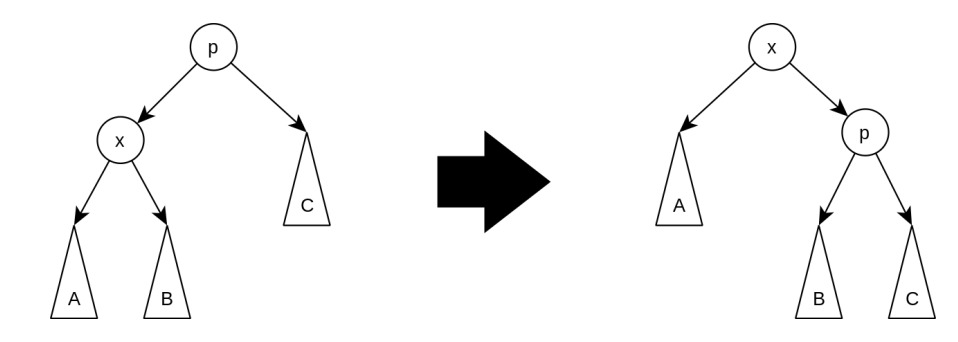
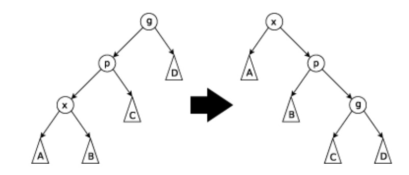
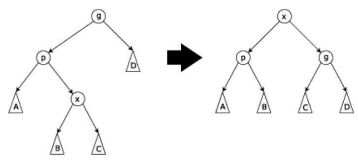
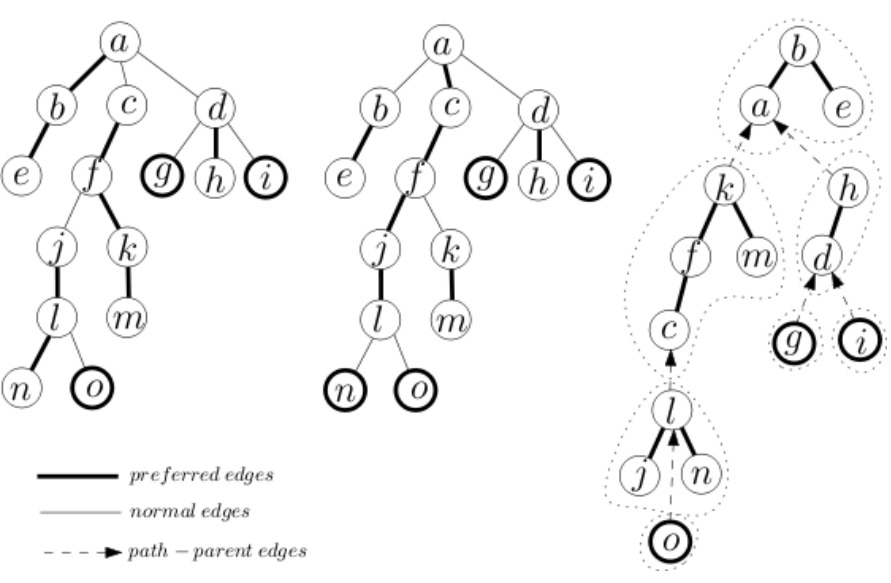

主要参考了 wys 的联考集团讲课。

摘要：$\log n-\log s$ 大法汇总。

### 前情提要

#### 势能分析

对于一个数据结构 $D$，我们定义 $\phi(D)$ 表示其势能。

定义 $c_i$ 表示对于一个数据结构第 $i$ 次操作的实际代价（如线段树递归 $\log n$ 层）
定义 $\hat c_i$ 为均摊代价，满足 $\hat c_i=c_i+\phi(D_i)-\phi(D_{i-1})$。

那么 $n$ 次操作的均摊代价总和为 $\sum_{i=1}^n\hat c_i=\sum_{i=1}^nc_i+\phi(D_n)-\phi(D_0)$。

当 $\phi(D)\geq 0$ 时，我们可以使用 $\sum_{i=1}^n \hat c_i+\phi(D_0)$ 来估算时间复杂度。

#### 简单的放缩依据

我们知道：若 $x+y\leq n,x\geq 0,y\geq 0$，那么 $xy\leq \dfrac 1 4 n^2$。
我们把结论的两边取 $\log$，那么 $\log x+\log y\leq -2+2\log n$，即 $2\leq 2\log n-\log x-\log y$。 

---

为了描述清楚我们接下来的问题，我们从 Splay 开始说起。

### Splay

我们对于一棵 BST，定义左旋与右旋，定义 Splay 的核心操作，`splay(x)`：分三种情况，将节点 $x$ 旋转到根，具体的，

1. 当 $x$ 的父亲为根时，执行【单旋 $x$】。
2. 当 $x$ 的左右儿子属性与其父亲的左右儿子属性相同时，执行【先单旋 $x$ 的父亲，再单旋 $x$】。
3. 否则（即 $x$ 与父亲的左右儿子属性不同），执行【单旋 2 次 $x$】。

我们使用势能分析证明 splay 操作的复杂度。

#### 复杂度分析

定义 $\phi(D)=\sum_{i=1}^n\log s(i)$，其中 $n$ 为 Splay $D$ 的节点个数，$s(i)$ 表示 $i$ 的子树大小。

下文定义 $s'(x)$ 为 $x$ 完成相应操作后的子树大小。

##### zig step

$$
\begin{align}\hat c&=1+\Delta\phi\\&=1+\log(s(B)+s(C)+1)-\log s(x)\\&\leq1+\log s'(x)-\log s(x)\\&\leq 1+3(\log s'(x)-\log s(x))\end{align}
$$

##### zig-zig step

$$
\begin{align}\hat c&=2+\Delta\phi\\&=2+\log(s(B)+s(C)+s(D)+2)+\log(s(C)+s(D)+1)\\&-\log s(x)-\log(s(A)+s(B)+s(C)+2)\end{align}
$$
将 $2$ 放缩成 $2\log s'(x)-\log s(x)-\log(s(C)+s(D)+1)$，
$\log(s(B)+s(C)+s(D)+2)$ 放缩成 $\log s'(x)$，
$-\log(s(A)+s(B)+s(C)+2)$ 放缩成 $-\log s(x)$。
$$
\begin{align}\hat c &\leq 3(\log s'(x)-\log s(x))\end{align}
$$

##### zig-zag step

$$
\begin{align}\hat c&=2+\Delta\phi\\&=2+\log(s(A)+s(B)+1)+\log(s(C)+s(D)+1)\\&-\log(s(A)+s(B)+s(C)+2)-\log s(x)\end{align}
$$
将 $2$ 放缩成 $2\log s'(x)-\log(s(A)+s(B)+1)-\log(s(C)+s(D)+1)$，
将 $-\log(s(A)+s(B)+s(C)+2)$ 放缩成 $-\log s(x)$。
$$
\begin{align}\hat c &\leq 2(\log s'(x)-\log s(x))\\&\leq 3(\log s'(x)-\log s(x))\end{align}
$$

---

综上，任意一个操作的均摊代价都被我们放缩成了 $3(\log s'(x)-\log s(x))$。
我们容易计算 $k$ 次操作的总均摊代价：
$$
1+\sum_{i=1}^k3(\log s_i(x)-\log s_{i-1}(x))\\
\leq1+3(\log s_k(x)-\log s_0(x))\leq 1+3\log n
$$

#### Splay 的其他操作

注意到在 Splay 上找到一个节点 $x$ 的操作次数和 `splay(x)` 同阶。

我们有了强大的 `splay` 操作后，其它操作考虑将需要处理的关键点 splay 到根处理就行了。

1. 合并两个 Splay

   将第一个 Splay 的最大元素 splay 至根，将第二个 Splay 作为新根的右儿子。

2. 分裂 Splay

   无论是按权值还是大小我们找到关键点 splay 到根，将其右儿子断掉即可。

3. 打标记

   类似 【子树修改】，【子树反转】的标记都是可以维护的。

### LCT

LCT 不同于重链剖分对树结构固定的链剖分，由于树结构的可变，LCT 采取更灵活的实链剖分，使用 Splay 维护每条实链（Preferred Paths）。

LCT 的核心操作是 `access(x)`，用来打通 $x$ 到根的路径，使这条路径成为一条实链。

一个 `access(l)` 的例子是：

给出 `access(x)` 的具体流程：

重复下列操作直到 $x$ 是原树的根。

1. 将 $x$ 旋转到所在 splay 的根（进行 `splay(x)`）。
2. 断掉 $x$ 的右子树，将 $x$ 的右子树连上上一次循环中 splay 的根。
3. 将 $x$ 修改为 $x$ 的虚父亲。

无论是换根、加边、删边，链查询，都基于 `access` 操作。
我们来分析 `access` 的复杂度。

#### 复杂度分析

首先，我们定义一种轻重链剖分。
对于边 $(u,v)$，$v$ 是 $u$ 的儿子，我们称这是一条重边当且仅当 $s(v)\geq \dfrac 1 2 s(u)$，否则我们称这是一条轻边。
一个显然的结论是，对于任意一个点 $x$，其到根的路径上最多只有 $\log n$ 条轻边。

我们将 LCT 中的边按虚实与轻重，可以分成 4 类。

1. heavy-preferred
2. heavy-unpreferred
3. light-preferred
4. light-unpreferred

对于一次 `access` 操作，只有 $\log n$ 条轻边可能由虚变实，只有 $\log n$ 条重边可能由实变虚。
反映到 4 类边的转换上，限制是 1 到 2 单次最多 $\log n$，4 到 3 单次最多 $\log n$，一个简单的势能分析可以告诉我们均摊边的切换单次 $O(\log n)$。
边的切换次数显然也是调用 splay 的次数，由于单次 splay 均摊 $O(\log n)$，我们可以得到 $O(\log^2n)$ 的一个上界。

我们回顾 Splay 的复杂度分析，单次 splay 操作的均摊代价是 $1+3(\log s'(x)-\log s(x))$。
这里的 $s(x)$ 是 $x$ 在Splay 里的子树大小。我们改变 $s(x)$ 的定义使其依然满足 Splay 的复杂度分析，且试图让 access 时的多次 splay 均摊代价之和能邻项抵消。

具体的，我们将 $s(x)$ 的定义修正成 $x$ 在 Splay 里的子树大小加上 Splay 子树内点的虚子树大小和。我们容易通过简单的放缩使得 access 的相邻两次 splay 进行抵消。

最终单次 access 的均摊代价应该是【均摊调用 splay 的次数】+【抵消后的代价：$3(\log n-\log s(x))$】=$O(\log n)$。

一个理解是 LCT 是一颗多叉的大 Splay。

#### LCT 的其他操作

1. `findroot(x)`：找到 LCT 维护的森林里 $x$ 所在连通块的根。

   考虑 `access(x)` 从 Splay 的根开始一直往左走到底就是根了，记得把找到的点 splay 上去保证复杂度。

2. `makeroot(x)`：使 $x$ 成为所在连通块的根。

   注意到这只会影响 $x$ 和原根路径上的点的父子关系。
   我们 `access(x)`，给 Splay 打上反转标记修改中序遍历。

3. `split(x,y)`：提取 $x$ 到 $y$ 的路径。

   `makeroot(x),access(y),splay(y)`

4. `cut(x,y)`：将边 $(x,y)$ 删掉。

   我们 `split(x,y)`，将 $x$ 的父边断掉，$y$ 的左儿子断掉。

5. `link(x,y)`：

   `split(x,y)`，令 $x$ 的虚父亲为 $y$。

---

AAA 树呢？AAA 树呢？AAA 树呢？
